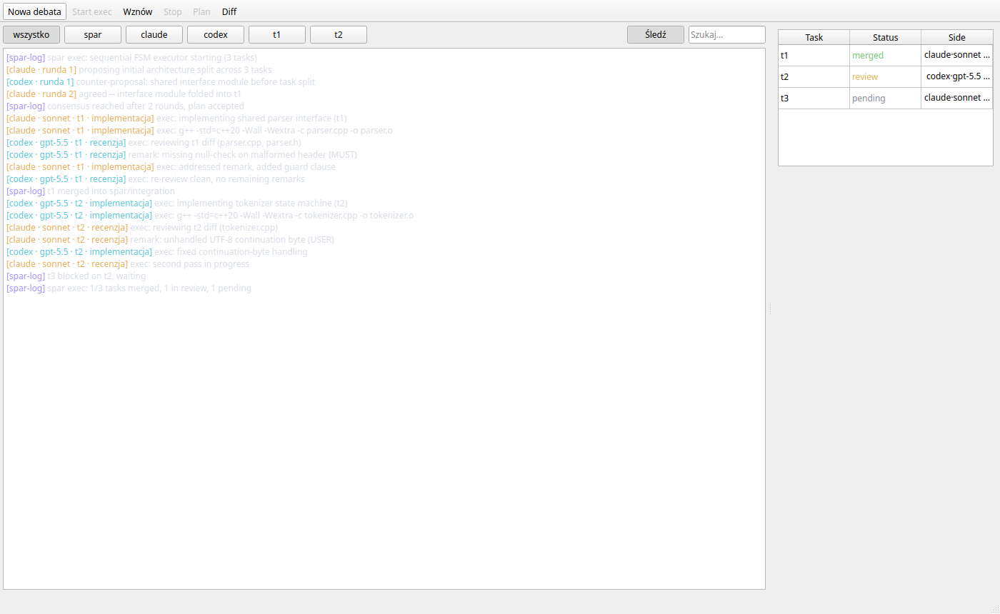
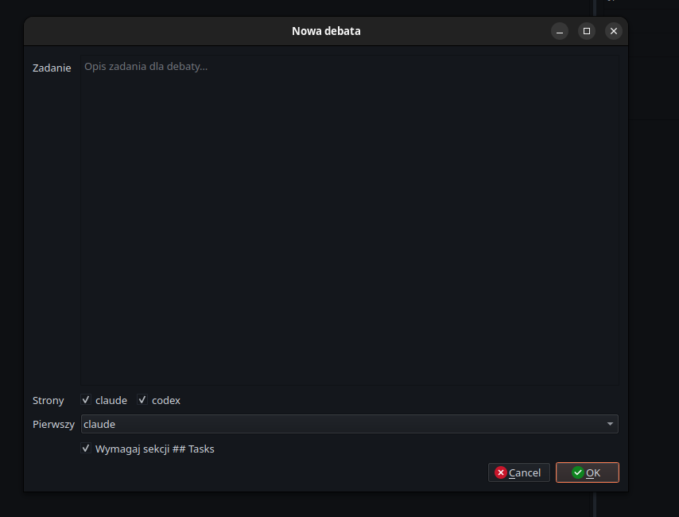

# spar

Two-vendor AI engineering engine: **Claude Code and Codex debate a plan to
consensus, then implement it task-by-task with cross-vendor code review and
objective test gates.** One side implements, the other reviews — always the
opposite vendor — so every plan, every task, and every diff gets a genuinely
independent second opinion. You (or your host agent) arbitrate at a few
well-defined gates.

Born from a manual workflow where two coding assistants iteratively review
and improve each other's work. The protocol details are in [PLAN.md](PLAN.md);
the agent-facing contract is in [docs/AGENT.md](docs/AGENT.md).

## The pipeline

```
requirements ──► spar (debate, --tasks) ──► agreed Plan + ## Tasks
                                                 │
                                     spar exec   ▼
      ┌──────────── per task: implement (side A) → cross-review (side B)
      │                        → per-task test → merge to integration ──┐
      │                                                                 │
      └── next task ◄───────────────────────────────────────────────────┘
                                                 │ all merged
                                                 ▼
                              final Test → user gate → merge to your branch
```

- **Debate**: both sides edit one artifact in alternating turns until they
  agree on the same version (hash consensus). With `--tasks` the plan must
  end with a machine-parsable `## Tasks` section — each task carries a side,
  an implementation model, a reviewer model, dependencies, a file scope, and
  a per-task test command.
- **Execution**: each task runs on its own branch + worktree; the implementing
  side writes code, the opposite side reviews the diff (read-only) until DONE;
  the task's test gates its merge into an integration branch. A final test
  over the whole integration gates the user-approved merge into your branch.
- **Guards everywhere**: file-scope enforcement with rollback, anti-spin and
  empty-implementation aborts, review-round and fix-task budgets, per-side
  implementation-model floors, crash-safe resumable state.

## Install

Not yet published to PyPI. For now:

```bash
pip install -e .
# or with uv:
uv tool install -e .
```

Requires `claude` and `codex` CLIs installed and authenticated:

```bash
claude -p "Hello"
codex exec "Hello"
```

## Quick start

```bash
# 1. Debate a plan with a task list
spar "Build a small CLI that ..." --sides claude,codex --first claude --tasks

# 2. Accept at the consensus gate, then execute the plan
spar exec

# 3. Approve the final merge when the integrated result passes its tests
```

Interrupted at any point? `spar --continue` (debate) or
`spar exec --continue` (execution) resumes from persisted state.

## Live output (watching the models work)

Everything both models say — full text, tool calls, executed commands —
streams live, prefixed `[side task role]` (e.g. `[claude t1 impl]`,
`[codex r0]`):

- **Running spar yourself?** The full stream is on stdout by default —
  nothing to set up.
- **An agent is driving spar?** The agent passes `--quiet` (only spar's own
  protocol lines reach its context), while the full stream ALWAYS lands in
  **`.spar/live.log`**. Watch it from a second terminal/split:

  ```bash
  spar watch               # colorized live viewer (gate banners, per-side colors)
  spar watch --from-start  # include what already happened this invocation
  ```

  Or let spar open the viewer window for you:

  ```bash
  spar ui   # tmux split / terminal window with `spar watch`; prints the
            # manual instruction when no known terminal is available
  ```

Notes: each spar invocation truncates `live.log` (fresh view per command);
the raw, complete event streams are always persisted per turn in
`.spar/transcript/` (claude: JSONL stream events; codex: JSONL).

### `spar gui` (dashboard-pilot)

For driving spar yourself with a GUI instead of a terminal:

```bash
pip install -e ".[gui]"   # or: pip install "spar-cli[gui]"
spar gui                  # operates on the current directory
spar gui --dir PATH       # operate on a different project directory
```

It shows a live stream pane (the same feed as `spar watch`), a task board,
a gate panel that lights up with the right buttons for whichever gate is
pending (consensus `Accept` auto-starts execution; `final_merge` always
requires an explicit manual confirmation), a toolbar for the run lifecycle
(New debate / Start exec / Resume / Stop), and Plan/Diff viewers. It is a
**solo pilot**: one person clicks through gates for one run, same as
running spar interactively in a terminal — it does not add multi-user or
remote-control capability.

**When an agent is driving spar, use the GUI for observation only** —
leave gate decisions to the agent. Running the GUI's own gate buttons
concurrently with an agent-driven headless run races against the agent's
`--gate` resumes and corrupts whose decision actually lands; if you open
the GUI on a directory another process already holds the run lock for, it
shows a read-only "locked" banner instead of live controls.


*A real run: live transcript (colored per side/model/task/role — reviewer
gpt-5.6-sol cross-checking claude's work, verdicts, gate lines) and the task
board tracking each task's merged/review/pending status.*


*Starting a run: task description, configured sides as checkboxes, first
speaker, and the `## Tasks` requirement toggle.*

The new-debate dialog also lets you sharpen a rough task draft with the
model before starting the run: a **"Grilluj z modelem…"** button opens a
chat dialog that drives a real `claude` session running the user's
grill-with-docs skill — questions arrive one at a time with lettered
options rendered as buttons (free-text answers also work); the session
ends when the model writes `.spar/requirements.md`, and its content
pre-fills the task field back in the new-debate form. Flow: draft task →
"Grilluj z modelem…" → chat Q&A (option buttons / free text) → model
writes `.spar/requirements.md` → task field pre-filled → debate.
Prerequisite: the user's `claude` CLI with a grill-with-docs skill
installed (`~/.claude/skills`); the grill runs on the claude side's
`debate_model`.

## Agent mode (headless)

spar is designed to be **driven by a host agent** (Claude Code / Codex) — see
[docs/adr/0003](docs/adr/0003-spar-as-agent-operated-engine.md). You grill the
requirements with your agent in conversation; the agent runs spar and relays
the gates. A ready-made Claude Code skill lives in
[skills/spar/SKILL.md](skills/spar/SKILL.md).

```bash
spar ui                                                       # open the live viewer for the human (once)
spar --task-file requirements.md --tasks --headless --quiet   # exit 10 = gate pending
spar status --json                                            # which gate, what options
spar --continue --headless --quiet --gate remarks:notes.md    # inject remarks into the debate
spar --continue --headless --quiet --gate accept              # accept the consensus

spar exec --headless --quiet                                  # gates pend the same way
spar exec --continue --headless --quiet --gate accept         # e.g. approve the final merge
```

Every interactive gate becomes: persist state → exit `10` → decision returns
via `--gate accept | abort | extend:<n> | remarks:<file>` on resume. Without
`--headless` all gates stay interactive on stdin.

### Exit codes

| Code | Meaning |
|------|---------|
| 0 | Success (consensus accepted / execution merged / already done) |
| 2 | Usage or configuration error (incl. a `--gate` that doesn't match the pending gate) |
| 3 | State/lock guard (another instance, dirty target, leftover artifacts) |
| 4 | Protocol abort (guard violation, unusable verdicts, adapter failure) |
| 5 | User abort at a gate |
| 10 | Gate pending (headless) — inspect `spar status --json`, resume with `--gate` |
| 130 | Interrupted (Ctrl+C) — state saved, resume with `--continue` |

## Configuration

Global `~/.config/spar/config.toml`, overridden by project `.spar/config.toml`:

```toml
[sides.claude]
models = ["opus", "sonnet", "haiku"]
default_model = "sonnet"
impl_models = ["opus", "sonnet"]   # floor: models allowed to IMPLEMENT tasks

[sides.codex]
models = ["gpt-5.5", "gpt-5.4"]
default_model = "gpt-5.5"

[debate]
max_rounds = 6
turn_timeout_sec = 900

[execution]
test_command = "make test"      # the final Test phase (and per-task fallback)
max_review_rounds = 3           # review-round budget before the user gate
max_fix_tasks = 2               # integration-fix budget before aborting
turn_timeout_sec = 900
```

Custom CLI binaries per side (e.g. wrappers): `spar -m claude -setCommand
claude-erli`, inspect with `spar --list-commands`.

## How it works

- **Artifact is the single source of truth**: both sides edit
  `.spar/artifact.md` directly; consensus is agreement on its hash.
- **Structured verdicts**: every turn ends with a parsed `<verdict>` block
  (status, resolved remarks, new remarks); prose is logged, never trusted.
- **Asymmetric cross-review**: in execution only the implementer edits (in an
  isolated worktree, write-enabled adapter); the reviewer reads the diff with
  a read-only adapter and blocks the merge with MUST remarks until satisfied.
  The reviewer is told which files belong to other, not-yet-merged tasks
  (foreign files) so isolation never produces false "missing file" blockers.
- **Objective gates**: per-task test commands and the final test command are
  hard exit-code gates, not model opinions.
- **State is fully resumable**: `.spar/session.json` (debate) and
  `.spar/exec.json` (execution) with atomic writes, single-instance locks,
  and git-reconciling crash recovery.

## Development

```bash
python3 -m pytest                 # full suite
SPAR_CONTRACT_TESTS=1 python3 -m pytest tests/test_contract_real_cli.py  # real-CLI contract tests
```

### Project layout

- `spar/cli.py` — CLI entry point (`spar`, `spar exec`, `spar status`, `spar watch`, `spar ui`)
- `spar/stream.py` — StreamSink: stdout + always-on `.spar/live.log`, `--quiet`
- `spar/watch.py` / `spar/ui.py` — live viewer + viewer-window spawner
- `spar/orchestrator.py` — debate loop, consensus, gates, turn prompts
- `spar/exec/loop.py` — execution FSM: task branches, merges, final test
- `spar/exec/review.py` — asymmetric cross-review loop, scope guard
- `spar/exec/tasklist.py` — `## Tasks` parser + validation (deps, models, scopes)
- `spar/exec/prompts.py` — implementer/reviewer prompt builders
- `spar/exec/gitops.py` — thin git wrappers (branches, worktrees, diffs)
- `spar/exec/state.py` / `spar/state.py` — persistent state + locks + recovery
- `spar/gates.py`, `spar/headless.py`, `spar/exec/headless.py` — agent mode
- `spar/status.py` — `spar status --json`
- `spar/guard.py` — debate artifact contract enforcement
- `spar/adapters/` — Claude Code / Codex CLI adapters
- `spar/verdict.py` — `<verdict>` block parser
- `spar/config.py` — TOML configuration
- `docs/AGENT.md` — host-agent protocol; `skills/spar/` — Claude Code skill
- `docs/adr/` — architecture decisions; `CONTEXT.md` — domain glossary

## License

MIT
